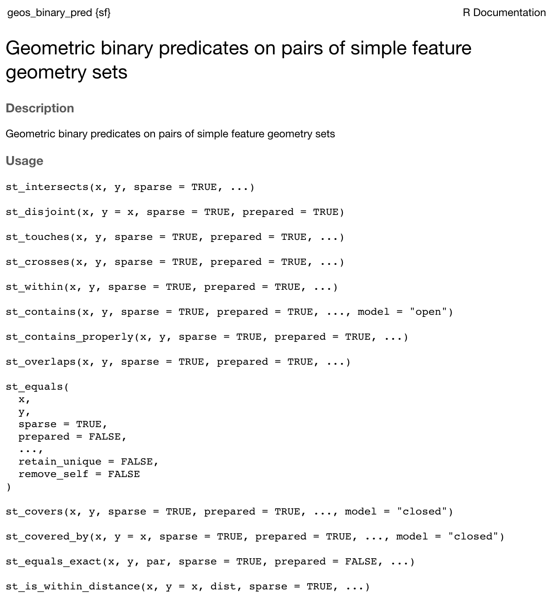

```{css, eval = TRUE, echo = F}
.remark-code{font-size: 100%}
```

```{r setup, include=FALSE}
oldoption <- options(scipen = 9999)
options(scipen = 9999)

knitr::opts_chunk$set(fig.width = 6, 
                      message = FALSE, 
                      warning = FALSE, 
                      comment = "", 
                      cache = FALSE, 
                      fig.retina = 3)

# Formating
library(knitr)
library(kableExtra)


# Work
library(dplyr)
library(sf)
library(ggplot2)
```

# Learning Objectives

- All spatial softwares (open and closed) are based on a core set of community based sofware

- Vector geometry is defined by coordinate pairs in a spatial reference systems

- Geometry can be associated with observations/rows in a `data.frame` allowing us to take advantage of the `data.frame` world

- Geometries  have a whole host of other capabilites including `measures` and `predicats`

---

# Spatial Data 

The Spatial community is built on a few organizing communities OSgeo and OGC

_and_ a few core libraries that drive EVERY spatial software you use!

These include: 
  - PROJ --> projections  
  
  - GEOS --> Geometery operations
  
  - GDAL --> geodata abstraction and
  processing

---

# Vector Data Model:

- Vector features can be decomposed into three different `geometric` primitives: 
 
  1. `points`
  2. `polylines`
  3. `polygons`

--

- Primitives can be thought of as the "building blocks" for all vector features

--

- All primitives can be decomposed into set(s) of numeric X-Y coordinates with a known grid (reference system)

--

- These reference systems are known as `PRØJ`ections, reference systems, ect

---


# Points

.pull-left[
- A point is composed of **one** coordinate pair (XY) in a specific coordinate system.

- POITNS can have a Z or M diminsion as well but are out of scope here

- A `POINT` has no length, no area anda dimension of 0.

```{r}
# POINT defined as numeric vector
(st_dimension(st_point(c(0,1))))
```
]

.pull-right[
```{r, fig.height=4, fig.align='center'}
ggplot() + 
  geom_point(aes(x = c(1,2,3), y = c(3,1,2))) + 
  labs(x = "X", y = "Y") 
```
]

---

# Polyline

.pull-left[
- A polyline is composed of a **ordered** sequence of two or more `POINT`s

- Points in a line are called vertices/nodes and explicitly define the connection between two points. 

- A **LINESTRING** has a length, has no area and  has a dimension of 1 (length)

```{r}
# LINESTRING defined by matrix
(st_dimension(st_linestring(matrix(1:4, nrow = 2))))
```
]

.pull-right[
```{r,fig.height=4, fig.align='center'}
ggplot() + 
  geom_line(aes(x = c(1,2,3), y = c(3,1,2))) + 
  geom_point(aes(x = c(1,2,3), y = c(3,1,2)), col = "red") + 
  labs(x = "X", y = "Y") 
```
]

---

# Polygon

.pull-left[
- A `POLYGON` is composed of 4 or more points whose starting and ending point are the same. 

- A **POLYGON** is surface stored as a list of its exterior and interior rings. 

- **POLYGON** have length,  area, and a dimension of 2. (area)

```{r}
# POLYGON defined by LIST (interior and exterior rings)
(st_dimension(st_polygon(list(matrix(c(1:4, 1,2), nrow = 3, byrow = TRUE)))))
```

]

.pull-right[
```{r, fig.height=4, fig.align='center'}
ggplot() + 
  geom_polygon(aes(x = c(1,2,3,1), y = c(3,1,2,3)), fill = "green", alpha = .5) + 
  geom_line(aes(x = c(1,2,3), y = c(3,1,2))) + 
  geom_point(aes(x = c(1,2,3), y = c(3,1,2)), col = "red") +
  labs(x = "X", y = "Y") 
```
]

---

# Projections

Place a numeric coordinate set in a relative/reference space:


```{r, fig.align='center', out.width="60%", echo = FALSE}
knitr::include_graphics("img/09-gcs-pcs.png")
```

---

- Projections can have angular units (lat/lon) - geographic coordinate systems (GCS), They are made up of:


--

    - Ellipsoid (squished "ideal" sphere model)

--

    - geoid (mathamatical model of gravitatial feild)
  
--
  
    - datum the relationship between the ellipsoid and geoid

--
      - datums can be local (NAD27), or,
    
--

      - global (WGS84, NAD83)
    
---
  
- SRS can also be projected (x-y axis, measurement units (m), false origin)

--

  - All PCS are based on GCS
      
--
  
  - Projections seek to place the 3D earth on 2D
      
--
  
  - Do this by defining a plane that can be conic, cylindrical or planar
      
--
  
  - "unfolding to this plane" creates distortion of **shape**, **area**, **distance**, or **direction**
      
--
  
  - The distortion is greater from point/lines of tangency or secanacy 

---

```{r}
o = data.frame(X = 0, Y = 0, name = "origin") |> 
  st_as_sf(coords = c("X", "Y"), crs = 5070)

o
```

```{r, echo = FALSE}
AOI = AOI::aoi_get(country = c("USA", "Mexico")) |> 
  st_transform(5070)

plot(AOI$geometry)
plot(o$geometry, add = T, col = "red", pch = 16)
```
---

# Measure (GEOS Measures)

- Measures are the questions we ask about the dimension of a geometry, once a reference has been established we can compute:
    
--
  
  - How long is a line or polygon perimeter (unit)
      
--
  
  - What is the area of a polygon (unit^2^)
      
--
  
  - How far are two object from one another (unit)
      
--
  
  
 - Measures come from the GEOS library
    
--
  
- Measures are in the **units** of the projection
 
---

# WKT: Well-Known-Text

Well-known text is a text markup language for representing vector geometry objects. 

A binary equivalent, known as well-known binary, is used to transfer and store the same information in a more compact form convenient for computer processing.

```{r}
(p1 = st_point(c(1,2)))

(ls1 = st_linestring(matrix(1:10, , 2)))

outer = matrix(c(0,0,10,0,10,10,0,10,0,0),ncol=2, byrow=TRUE)
hole1 = matrix(c(1,1,1,2,2,2,2,1,1,1),ncol=2, byrow=TRUE)
pts = list(outer, hole1)
(pl1 = st_polygon(pts))
```

---

# Simple Features Model

Simple Features (officially Simple Feature Access) is both an OGC and International Organization for Standardization (ISO) standard that specifies a common storage and access model of (mostly) two-dimensional geometries.


```{r, fig.align='center', echo = FALSE, out.width="75%" }
knitr::include_graphics("img/09-sf-model.png")
```

---

# Example!

```{r}
gages <- read.csv(system.file("extdata", "Gages_flowdata.csv", package = "awra2020spatial")) |> 
  select(SOURCE_FEA, STATE, LAT_SITE, LON_SITE)
```

```{r, echo = FALSE}
glimpse(gages)
```

--

```{r}
gages <- gages %>% 
  st_as_sf(coords = c("LON_SITE", "LAT_SITE"), crs = 4269)
```

```{r,  echo = FALSE}
glimpse(gages)
```

--

```{r}
st_distance(gages[1,], gages[2,])
```

---

# data.frames and geometries Tables

- In R and Python, the sf and geopandas libraries allow geometries to act as a attribute of data.frames by extending the capabilites of the data.frame object.

- This allows any observation to be assocaited with attribures and geometry fot GIS applications!

```{r, echo = FALSE}
gages
```

--

- In shapefiles, these attributes are stored in a ".dbf" file, the `geometry` is stored in a ".shp" file, and they are related through a ".shx" file.


---

# The simple feature R object

-  a spatial object is a `data.frame` class that extends core primitive types and structures.

```{r}
gages[1,]
class(gages)
typeof(gages)
```

---

# Drop the structure

```{r}
(d = st_drop_geometry(gages) %>% head())

class(d)
```


---
class:inverse, middle, center
# R as a GIS
---

## Simple features (sf) package

The `sf` package implements the Simple Features standard for R by allowing geometries to be associated with data.frame rows.

--

- The `sf` package contains functions that bind 
  - to `GDAL` for reading and writing data,
  - to `GEOS` for geometrical operations, and 
  - to `PRØJ` for projection conversions and datum transformations

```{r}
sf::sf_extSoftVersion()
```

---

## Simple features (sf) package 

- represents <span class="code">simple features</span> as records in a `data.frame` or `tibble` with a `geometry list-column`


```{r, fig.align='center', out.width="75%", echo = FALSE}
knitr::include_graphics("img/09-sf-depends.png")
```

---

# Extending GDAL

With respect to GDAL, some utilities are directly exposed by `sf` as can be seen in the available function signatures:

```{r}
grep("gdal", ls("package:sf"), value = T)
```


---
# Extending PRØJ

```{r}
grep("proj_|crs", ls("package:sf"), value = T)
```

---

# Extending GEOS/Simple Featrues Access

```{r, out.width="100%", size="tiny"}
grep("st_", ls("package:sf"), value = T)
```

---

# Spatial filters and Joins

 - `data.frame` filters and joins were based on boolean conditions and relational keys
 
 -  spatial filters are also based on boolean conditions
 
 -  however, spatial joins are ALSO based on boolean conditions

-  Boolean condions for geometries are defined by spatial realtions!

- Spatial relations dictated are dictated by the Interiors, Boundaries and Exteriors


---

## Interior, Boundary and Exterior

```{r fig.height=6, fig.width=10, echo=FALSE, message=FALSE, fig.align='center'}

g = st_bbox(c(xmin = 0, xmax = 10, ymax = 6, ymin = 0)) %>% 
  st_as_sfc() %>% 
  st_make_grid(cellsize = 1)

point = st_sfc(st_point(c(5,3)))


p0 = ggplot() + 
  geom_sf(data = g, fill = "white") + 
  geom_sf(data = point, col = "red", size  = 3) + 
  theme_void() + 
  labs(title = "POINT")

p1 = ggplot() + 
  geom_sf(data = g, fill = "white") + 
  geom_sf(data = point, col = "red", size  = 3) + 
  theme_void() + 
  labs(title = "Interior (POINT)")

p2 = ggplot() + 
  geom_sf(data = g, fill = "white") + 
  geom_sf(data = point, col = "navy", size  = 3) + 
  theme_void() + 
  labs(title = "Boundary (POINT)")

p3 = ggplot() + 
  geom_sf(data = g, fill = "yellow", alpha = .5) + 
  geom_sf(data = point, col = "red", size  = 3) + 
  theme_void() + 
  labs(title = "Exterior (POINT)")


l0 = ggplot() + 
  geom_sf(data = g, fill = "white") + 
  geom_segment(aes(x = 2, y = 2, xend = 8, yend = 4 ), col = "red", size = 2) +
  theme_void() + 
  labs(title = "LINESTRING")


l1 = ggplot() + 
  geom_sf(data = g, fill = "white") + 
  geom_point(aes(x = 2, y = 2), size = 3, col = "navy") +
  geom_point(aes(x = 8, y = 4), size = 3, col = "navy") + 
  geom_segment(aes(x = 2, y = 2, xend = 8, yend = 4), col = "red") +
  theme_void() + 
  labs(title = "Interior (LINESTRING)")

l2 = ggplot() + 
  geom_sf(data = g, fill = "white") + 
  geom_point(aes(x = 2, y = 2), size = 3, col = "red") +
  geom_point(aes(x = 8, y = 4), size = 3, col = "red") + 
  theme_void() + 
  labs(title = "Boundary (LINESTRING)")

l3 = ggplot() + 
  geom_sf(data = g, fill = "yellow", alpha = .5) + 
  geom_point(aes(x = 2, y = 2), size = 3, col = "navy") +
  geom_point(aes(x = 8, y = 4), size = 3, col = "navy") + 
  geom_segment(aes(x = 2, y = 2, xend = 8, yend = 4), col = "red") +
  theme_void() + 
  labs(title = "Exterior (LINESTRING)")


pg = g[c(23:28, 33:38)] 

area = st_union(pg) 

border = st_cast(area, "LINESTRING")

  
pg0 = ggplot() + 
  geom_sf(data = g, fill = "white") + 
  geom_sf(data = area, fill = "red")+
  geom_sf(data = border,  color = "navy", size = 3)+
  theme_void() + 
  labs(title = "POLYGON")

pg1 = ggplot() + 
  geom_sf(data = g, fill = "white") + 
  geom_sf(data = area, fill = "red", alpha = .5)+
  theme_void() + 
  labs(title = "Interior (POLYGON)")

pg2 = ggplot() + 
  geom_sf(data = g, fill = "white") + 
  geom_sf(data = border,  color = "red", size = 3)+
  theme_void() + 
  labs(title = "Boundary (POLYGON)")

pg3 = ggplot() + 
  geom_sf(data = g, fill = "yellow", alpha = .5) + 
  geom_sf(data = pg,  fill = "white")+
  theme_void() + 
  labs(title = "Exterior (POLYGON)")

gridExtra::grid.arrange(p1,p0,p2,p3,
                        l0, l1, l2, l3,
                        pg0,pg1,pg2,pg3, 
                        nrow = 3)

```

---

## DE-9IM

- Dimensionally Extended 9-Intersection Model (DE-9IM)

- The DE-9IM is a **topological** model and (standard) used to describe the spatial relations of two geometries 

--

- Used in geometry, point-set topology, geospatial topology

--

- The **DE-9IM** _matrix_ provides a way to classify geometry relations using the set **{0,1,2,F}** or **{T,F}**

- Here {0,1,2,F} describe the diminsion of the intersection(POINT, LINE, AREA, NONE), and {T, F} is any.

---

The **DE-9IM** matrix is based on a 3x3 intersection matrix testing the following relations:

- II, IE, IB
- BI, BE, BB,
- EI, EE, EB


---

```{r, fig.align='center', out.width = "50%", echo = FALSE}
knitr::include_graphics('img/de9im3.jpg')
```

---

# Spatial Predicates

- With a **{T,F}** matrix domain across the I,B, E space, there are 512 possible relations that can be grouped into binary classification schemes. 

--

- About 10 of these, have been given a common name such as _intersects_, _touches_, and _within_. 

-- 

These are called spatial predicates and return a boolean value for each interacting geometry.

--

Can be serialize as a "DE-9IM string code" representing the matrix in a single string element


---

```{r, fig.align='center', out.width = "50%", echo = FALSE}

```

---

# Spatial Joins and fitlters

So... 

In a `data.frame`, a row is kept if the supplied boolen codition is true. Simularly `sf` provides st_filter(x,y)

The critical arguement this filter is the .predicate.

The default is `st_intersects`

---

# Example Dataset

- Geometry X is a 3 feature polygon colored in red
- Cemetery Y is a 4 feature polygon colored in blue

```{r, echo = FALSE}
b0 = st_polygon(list(rbind(c(-1,-1), c(1,-1), c(1,1), c(-1,1), c(-1,-1))))
b1 = b0 + 2
b2 = b0 + c(-0.2, 2)
x = st_sfc(b0, b1, b2) |> 
  st_as_sf() |> 
  mutate(ID = 1:3)
a0 = b0 * 0.8
a1 = a0 * 0.5 + c(2, 0.7)
a2 = a0 + 1
a3 = b0 * 0.5 + c(2, -0.5)
y = st_sfc(a0,a1,a2,a3) |> 
  st_as_sf() |> 
  mutate(ID = c("A", "B", "C", "D"))
plot(x$x, border = 'red')
plot(y$x, border = 'blue', add = TRUE)
```

---

## Binary logical operations 

Returns either a *sparse* matrix

```{r}
st_intersects(x,y)
```

or a *dense* matrix

```{r}
st_intersects(x, y, sparse = FALSE)
```

---

# Boolean, Spatial Operators

```{r}
st_filter(x,y, .predicate = st_intersects)

sf::st_filter(x,y, .predicate = st_contains)
```

```{r}
sf::st_join(x, y, .predicate = st_intersects)

sf::st_join(y, x, .predicate = st_intersects)
```

---

# Wrap it all up! 

- You have been tasked to identify the population living along the Mississippi River systems

- You are interested in the county level since most flood control measures and flood response efforts are enforced by county EMAs 

- Federal funding however is administered at the state level so you need population counts aggregated to state...

---

# River Data!

````{r}
# Global River Shapefile filtered to the Mississippi System
(miss = '/vsizip/{/vsicurl/https://www.naturalearthdata.com/http//www.naturalearthdata.com/download/50m/physical/ne_50m_rivers_lake_centerlines.zip}/ne_50m_rivers_lake_centerlines.shp' |> 
  read_sf() |> 
  filter(name == "Mississippi", featurecla == "River") |> 
  select(name))

```

---
 
# Population Data!

```{r}
(popdata = read.csv('https://www2.census.gov/programs-surveys/popest/datasets/2020-2021/counties/totals/co-est2021-alldata.csv') |> 
  filter(STNAME != CTYNAME) |> 
  mutate(fip_code = paste0(sprintf("%02s", STATE), sprintf("%03s", COUNTY)) ) |> 
  select(fip_code, POPESTIMATE2021))
```

---

# County Data!

```{r}
(us_counties = AOI::aoi_get(state = "conus", county = "all") |> 
  left_join(popdata, by = "fip_code"))
```

---
 
# County Data!

```{r}
# Which counties intersect this system
misscount = st_filter(us_counties, 
                      miss,  
                      .predicate = st_intersects) 

# Find all counties in the intersecting states
counties =  filter(us_counties, state_name %in% c(misscount$state_name) ) 

```

---

`r flipbookr::chunk_reveal("q11", title = "##Intersecting Counties", widths = c(40,60,0))`

```{r q11, include = FALSE}
ggplot() + 
  geom_sf(data = counties, lty = 3) + 
  geom_sf(data = misscount, fill = 'red', alpha = .5) +
  geom_sf(data = miss, col = "blue") + 
  theme_linedraw()
```

---

`r flipbookr::chunk_reveal("q12", title = "##Intersecting Populations", widths = c(40,60,0))`

```{r q12, include = FALSE}
filter(misscount) |> 
  st_drop_geometry() |> 
  group_by(state_name) |> 
  summarize(pop = sum(POPESTIMATE2021)) |> 
  arrange(-pop)
```


